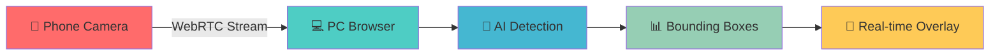

<div align="center">

# 🎥 WebRTC VLM Detection

### *Real-time Multi-Object Detection with Phone-to-PC Video Streaming*


---

### 📱➡️💻 Turn your phone into a wireless camera with real-time AI detection!

*Stream live video from your phone to PC via WebRTC and watch AI detect objects in real-time with beautiful bounding box overlays.*

</div>

## ✨ Features

<table>
<tr>
<td width="50%">

### 🎯 **Core Capabilities**
- 📱 **Phone Camera Streaming** - Use your phone as a wireless camera
- 💻 **Dual Camera View** - PC and phone cameras side by side
- 🤖 **Real-time Detection** - Multi-color object detection with bounding boxes
- 🌐 **WebRTC P2P** - Direct peer-to-peer connection
- 📊 **Live Metrics** - FPS, detection count, connection status

</td>
<td width="50%">

### 🚀 **Deployment Options**
- 🐳 **Docker Ready** - One-command containerized deployment
- 🌍 **Remote Access** - ngrok integration for internet access
- ⚡ **Production Build** - Optimized static file serving
- 🔧 **Cross-Platform** - Windows, macOS, Linux support
- 📱 **Mobile Optimized** - Responsive design for all devices

</td>
</tr>
</table>

## 🎬 Demo



## 🚀 Quick Start

### 🐳 **Docker (Recommended)**

```bash
# 🎯 One command to rule them all!
docker-compose up --build

# 🌐 With remote access (requires ngrok token)
NGROK_AUTHTOKEN=your_token docker-compose --profile remote up --build
```

### 💻 **Local Development**

```bash
# 🪟 Windows
start.bat

# 🐧 Linux/macOS
chmod +x ./start.sh && ./start.sh

# 🌍 With remote access
./start.sh --ngrok
```

### 📱 **Usage Steps**

1. **🖥️ PC**: Open http://localhost:8000
2. **📷 Start Camera** → **🔗 Connect Phone** → **🎯 Start Detection**
3. **📱 Phone**: Scan QR code → Auto-connects as remote camera
4. **🎉 Enjoy**: Watch real-time detection on both camera feeds!

## 🏗️ Architecture

<div align="center">

```ascii
┌─────────────────┐    WebRTC P2P     ┌─────────────────┐
│   📱 Phone      │◄─────────────────►│   💻 PC         │
│                 │                   │                 │
│ • Camera Stream │                   │ • Dual Display  │
│ • Auto Connect  │                   │ • AI Detection  │
│ • Touch UI      │                   │ • Metrics       │
└─────────────────┘                   └─────────────────┘
                                              │
                                              ▼
                                    ┌─────────────────┐
                                    │  🤖 Detection   │
                                    │                 │
                                    │ • Multi-Color   │
                                    │ • Real-time     │
                                    │ • Bounding Box  │
                                    └─────────────────┘
```

</div>

## 🛠️ Tech Stack

<div align="center">

| Frontend | Backend | AI/CV | DevOps |
|----------|---------|-------|--------|
|  |  |  |  |
|  |  |  |  |
|  |  |  |  |

</div>

## 📊 Performance

- **🚀 Latency**: < 200ms end-to-end
- **📹 FPS**: 5-10 FPS real-time detection
- **🎯 Detection**: Multi-color object recognition
- **📱 Mobile**: Optimized for phone cameras
- **🌐 Network**: Efficient WebRTC streaming

## 🔧 Configuration

### 🎨 **Detection Colors**
- 🔴 **Red Objects** - Primary detection
- 🔵 **Blue Objects** - Secondary detection  
- 🟢 **Green Objects** - Tertiary detection
- 🟡 **Yellow Objects** - Quaternary detection

### ⚙️ **Environment Variables**
```bash
SERVE_BUILT=true          # Production mode
FRONTEND_URL=http://...   # Frontend URL
BACKEND_URL=http://...    # Backend URL
NGROK_AUTHTOKEN=...       # Remote access token
```

## 🐛 Troubleshooting

<details>
<summary>📱 <strong>Phone Connection Issues</strong></summary>

- ✅ Ensure both devices on same WiFi
- ✅ Check camera permissions in browser
- ✅ Try different browsers (Chrome recommended)
- ✅ Use ngrok for remote access

</details>

<details>
<summary>🎥 <strong>Video Stream Problems</strong></summary>

- ✅ Check WebRTC connection in console
- ✅ Verify STUN server connectivity
- ✅ Test with `chrome://webrtc-internals`
- ✅ Restart both applications

</details>

<details>
<summary>🐳 <strong>Docker Issues</strong></summary>

- ✅ Ensure Docker Desktop is running
- ✅ Check port 8000 availability
- ✅ Clear Docker cache: `docker system prune`
- ✅ Run as administrator if needed

</details>

## 🤝 Contributing

We welcome contributions! Here's how you can help:

- 🐛 **Bug Reports** - Found an issue? Let us know!
- ✨ **Feature Requests** - Have an idea? Share it!
- 🔧 **Pull Requests** - Code improvements welcome!
- 📖 **Documentation** - Help improve our docs!

## 📄 License

<div align="center">

**MIT License** - Feel free to use this project for anything!

---

### 🌟 **Star this repo if you found it helpful!** 🌟

*Made with ❤️ for the computer vision community*

</div>