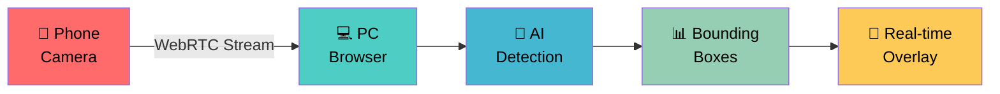

<div align="center">

# 🎥 WebRTC VLM Multi-Object Detection

### *Real-time multi-object detection on live video streamed from phone via WebRTC with browser overlay*


---

### 📱➡️💻 *One-line goal: Stream phone camera → WebRTC → AI detection → real-time bounding box overlay in browser*

</div>

---

## ⚠️ Note
This project was developed as part of an interview assignment.
The work went through several iterations with redundant files and trial-and-error during the build process. While earlier versions may contain extra files or corrections, the current structure is streamlined, functional, and aligned with the assignment requirements.

---

## 🚀 Quick Start

### 🎯 **Choose Your Method:**

#### Option 1: 💻 Local Development (Same WiFi Only)

**For Windows:**
1. Navigate to project folder in File Explorer
2. Double-click `start.bat` file
3. Two command windows will open (backend + frontend)
4. Wait 10-15 seconds for both to start
5. Open: http://localhost:5173

> 📱 **Phone must be on same WiFi network as PC**

**For Mac/Linux:**
1. Open Terminal in project folder
2. Run these commands:
   ```bash
   chmod +x start.sh
   ./start.sh
   ```
3. Open: http://localhost:5173

#### Option 2: 🌍 Remote Access (Recommended for Phone)

**For Windows (Works from anywhere):**
1. Double-click `start_ngrok.bat` file
2. Wait for ngrok tunnel setup
3. Open: http://localhost:5173
4. QR code will show ngrok URL for phone access

> 🌐 **Phone can be anywhere with internet connection**
> 💰 **Uses single ngrok tunnel (free tier compatible)**

**For Docker:**
```bash
NGROK_AUTHTOKEN=your_token docker-compose --profile remote up --build
```

**For Linux/macOS:**
```bash
./start.sh --ngrok
```

#### Option 3: 🐳 Docker (Advanced Users Only)
```bash
# Navigate to project folder, then run:
docker-compose up --build
# Then open: http://localhost:8000
```

> ⚠️ **Note:** Docker has dependency issues and may not work reliably. **Use Option 1 or 2 instead** for guaranteed results.

---

### 📱 **How to Use:**

**Step 1:** Start the application using any method above

**Step 2:** On your PC, open the browser to:
- 🐳 Docker: [http://localhost:8000](http://localhost:8000)
- 💻 Local: [http://localhost:5173](http://localhost:5173)

**Step 3:** Click **"Start Camera"** button

**Step 4:** Click **"Connect Phone"** to see QR code

**Step 5:** On your phone:
- Scan the QR code with your phone camera
- Allow camera permissions in browser
- Phone will auto-connect

**Step 6:** Click **"Start Detection"** to begin real-time object detection

**Step 7:** 🎉 Watch live detection with bounding boxes on both screens!

> 💡 **Troubleshooting:** If your phone can't reach your laptop, use the remote access option with ngrok

## ✨ Features

<table>
<tr>
<td width="50%">

### 🎯 **Core Capabilities**
- 📱 **Phone Camera Streaming** - Use your phone as a wireless camera
- 💻 **Dual Camera View** - PC and phone cameras side by side
- 🤖 **Real-time Detection** - Multi-color object detection with bounding boxes
- 🌐 **WebRTC P2P** - Direct peer-to-peer connection
- 📊 **Live Metrics** - FPS, detection count, connection status

</td>
<td width="50%">

### 🚀 **Detection Mode**
- 🎨 **Server-side detection** - Color-based object detection using OpenCV
- ⚡ **Frame processing** - 5 FPS with 224x224 resolution
- 🌈 **Multi-color detection** - Red, blue, green, yellow objects
- 📏 **Normalized coordinates** - [0..1] for resolution independence
- ⏱️ **Real-time processing** - ~200ms latency

</td>
</tr>
</table>

---

## 🎬 Demo



---

## 📊 Benchmarking

```bash
# Run 30-second benchmark
./bench/run_bench.sh --duration 30 --mode server

# Check results
cat metrics.json
```

**Output includes:**
- Median & P95 end-to-end latency
- Processed FPS
- Uplink/downlink bandwidth (kbps)
- Server latency (inference_ts - recv_ts)
- Network latency (recv_ts - capture_ts)

## API Contract

Detection results follow this JSON format:

```json
{
  "frame_id": "string_or_int",
  "capture_ts": 1690000000000,
  "recv_ts": 1690000000100,
  "inference_ts": 1690000000120,
  "detections": [
    { "label": "person", "score": 0.93, "xmin": 0.12, "ymin": 0.08, "xmax": 0.34, "ymax": 0.67 }
  ]
}
```

- **Coordinates**: Normalized [0..1] for resolution independence
- **Timestamps**: Milliseconds for latency calculation
- **Frame alignment**: Uses frame_id and capture_ts for overlay sync

## Detection Implementation

**OpenCV Color Detection:**
- HSV color space filtering for object detection
- Supports red, blue, green, and yellow objects
- Morphological operations for noise reduction
- Normalized bounding box coordinates [0..1]
- Real-time processing with ~200ms latency

## Requirements

**Development Machine:**
- Docker & Docker Compose
- Node.js 16+ (for local development)
- Python 3.9+ (for local development)
- 4GB RAM minimum

**Phone:**
- Chrome (Android) or Safari (iOS)
- Camera permissions
- Same WiFi network OR internet access via ngrok

## 🏗️ Architecture

<div align="center">

```ascii
┌─────────────────┐    WebRTC P2P     ┌─────────────────┐
│   📱 Phone      │◄─────────────────►│   💻 PC         │
│                 │                   │                 │
│ • Camera Stream │                   │ • Dual Display  │
│ • Auto Connect  │                   │ • AI Detection  │
│ • Touch UI      │                   │ • Metrics       │
└─────────────────┘                   └─────────────────┘
                                              │
                                              ▼
                                    ┌─────────────────┐
                                    │  🤖 Detection   │
                                    │                 │
                                    │ • Multi-Color   │
                                    │ • Real-time     │
                                    │ • Bounding Box  │
                                    └─────────────────┘
```

</div>

### 🛠️ Tech Stack

<div align="center">

| Frontend     | Backend   | AI/CV       | DevOps           |
| ------------ | --------- | ----------- | ---------------- |
| React + Vite | FastAPI   | OpenCV      | Docker + Compose |
| WebRTC       | WebSocket | NumPy       | ngrok            |

</div>

### 🔄 Detection Pipeline
1. 📱 Phone captures video frame via WebRTC
2. 💻 Browser receives frame and sends to detection API
3. 🤖 OpenCV processes frame for color-based objects
4. 📊 Server returns normalized bounding boxes
5. 🎯 Canvas overlay displays results in real-time

### 📈 Performance
* **🚀 Latency**: < 200ms end-to-end
* **📹 FPS**: 5–10 FPS real-time detection
* **🎯 Detection**: Multi-color object recognition
* **📱 Mobile**: Optimized for phone cameras
* **🌐 Network**: Efficient WebRTC streaming

## 🐛 Troubleshooting

<details>
<summary>📱 <strong>Phone Connection Issues</strong></summary>

* ✅ Ensure both devices are on same WiFi
* ✅ Check camera permissions in browser
* ✅ Try different browsers (Chrome recommended)
* ✅ Use `./start.sh --ngrok` for remote access

</details>

<details>
<summary>🎥 <strong>Video Stream Problems</strong></summary>

* ✅ Check WebRTC connection in console
* ✅ Verify STUN server connectivity
* ✅ Test with `chrome://webrtc-internals`
* ✅ Restart both applications

</details>

<details>
<summary>🎯 <strong>Detection Issues</strong></summary>

* ✅ Confirm timestamps are in milliseconds
* ✅ Check normalized coordinates [0..1]
* ✅ Verify frame_id matching
* ✅ Ensure proper lighting for color detection

</details>

<details>
<summary>⚡ <strong>Performance Issues</strong></summary>

* ✅ Frame processing limited to 5 FPS
* ✅ Resolution downscaled to 224x224
* ✅ Check `htop` or Task Manager
* ✅ Ensure proper WebRTC compression

</details>

## Project Structure

```
webrtc-vlm-detection/
├── client/                 # React frontend
│   ├── src/
│   │   ├── App.jsx        # Main application
│   │   ├── webrtc.js      # WebRTC utilities
│   │   └── metrics.jsx    # FPS counter
│   └── public/
├── server/                 # FastAPI backend
│   ├── app.py             # Main server
│   └── utils/
│       └── vlm_detector.py # Detection logic
├── bench/                  # Benchmarking scripts
├── docker-compose.yml      # Container orchestration
├── Dockerfile             # Container definition
├── start.sh               # Convenience script
├── start.bat              # Windows script
└── README.md              # This file
```

## Next Improvements

1. **ML Models** - Replace color detection with YOLO/MobileNet
2. **Frame dropping** - Implement backpressure handling
3. **Adaptive quality** - Dynamic resolution based on network
4. **Multi-device** - Support multiple phone connections
5. **Performance** - GPU acceleration for detection

---

## 🤝 Contributing

This is primarily an **assignment project**, but contributions for cleanup, improvements, and extended features are welcome:

* 🐛 Bug Reports
* ✨ Feature Requests
* 🔧 Pull Requests
* 📖 Documentation

---

## 📄 License

<div align="center">

**MIT License** - Free to use for learning & development

**Demo Video:** [Loom Link] | **Metrics:** See `metrics.json`

---

### 🌟 *Star this repo if you found it helpful!* 🌟

*Made with ❤️ as part of an academic assignment in Computer Vision*

</div>